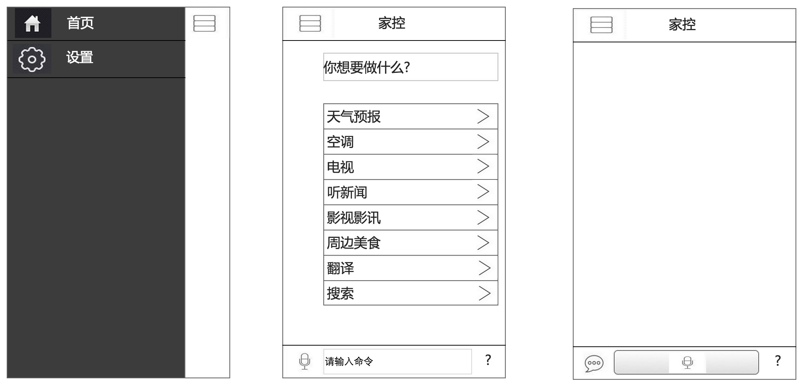
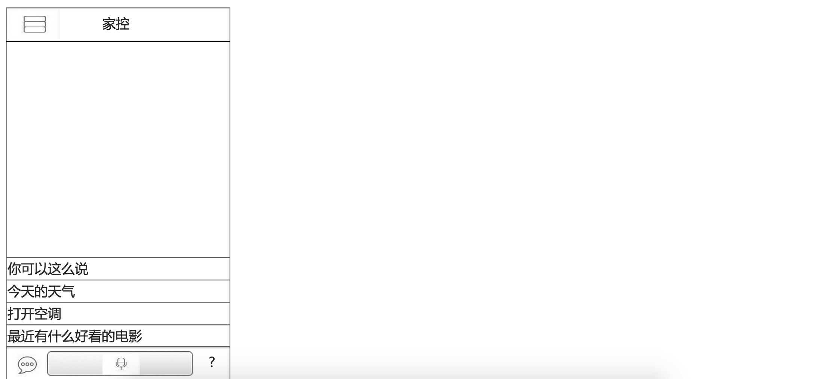

智能家居
======================
* 控制家里所有的家电
* 声控
* 人脸识别

系统图
======================
* 人脸识别(借助讯飞语音和百度人脸识别平台)
* 输入部分 (IOS & Android & 微信订阅号或者公众号)
  * 文字
  * 语音 (借助讯飞语音和百度语音开放平台)
* 语意识别 (java apache Lucene)
* [指令中心](docs/cmd.md)

APP UI图
======================
* 
* 

开发语言
======================
* python
* java


代码结构
======================
* src  源码目录
* docs 文档目录
* .provision ansible自动化 ```ansible-playbook -i host playbook.yml

快速入门
=====================
* 操作系统 Ubuntu
* ansible自动化
* [环境配置](docs/install.md)
* [文本分类](http://textgrocery.readthedocs.org/zh/latest/index.html)
* [PM2.5](http://www.pm25.in/api_doc)
* [人脸识别](http://www.faceplusplus.com.cn/uc_home/)
* [电视节目表](http://epg.tvsou.com/programys/TV_44/Channel_18/W1.htm)
